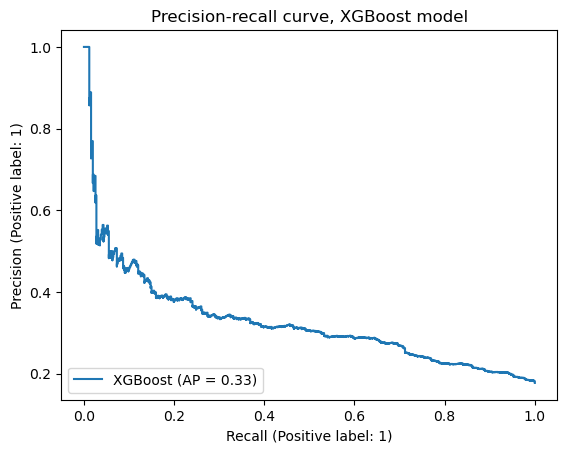

# Waze User Churn Prediction

Predicting which Waze users will stop using the app, so retention efforts can reach them first. This is
a project from the **Google Advanced Data Analytics Professional Certificate**, built on its synthetic
Waze dataset (14,999 users, 17.7% churned).

## Result

**The data doesn't carry enough signal to predict churn well, and the honest answer is to say so.**

| Model | Split | Recall (churned) | Precision | F1 | Accuracy |
|---|---|---:|---:|---:|---:|
| Logistic regression | Test | 0.09 | 0.52 | 0.16 | 0.82 |
| Random forest | Validation | 0.12 | 0.45 | 0.19 | 0.82 |
| XGBoost | Validation | 0.17 | 0.43 | 0.24 | 0.81 |
| **XGBoost (champion)** | **Test** | **0.17** | **0.39** | **0.23** | **0.81** |
| XGBoost, threshold 0.124 | Test | **0.50** | 0.30 | 0.38 | 0.71 |

Always predicting "retained" already scores 82% accuracy, so accuracy says almost nothing here.
Recall on churned users is the metric that matters, and at the default threshold the champion catches
only 1 churner in 6.

<p align="center"></p>

**The trade-off that makes it usable:** a false positive only costs a user an extra reminder email, so
precision can be sacrificed. Lowering the decision threshold to 0.124 catches **half of all churners**
at 30% precision. That's good enough to guide a low-risk retention campaign, not to drive
consequential decisions.

**What the models leaned on:** six of XGBoost's ten most important features were ones I engineered,
such as `km_per_driving_day` and `percent_sessions_in_last_month`. The earlier logistic regression
leaned almost entirely on one feature, `activity_days`.

## The workflow

Each stage has a notebook and an executive summary, following Google's PACE framework
(Plan, Analyze, Construct, Execute):

| # | Stage | Notebook | Summary |
|---|---|---|---|
| 1 | Data inspection | [Notebook](Waze/Waze%20project%20lab.ipynb) | [PDF](Waze/Preliminary%20Waze%20executive%20summary.pdf) |
| 2 | Exploratory data analysis | [Notebook](Waze/EDA/Exploratory%20Data%20Analysis%20Waze%20project%20lab.ipynb) | [PPTX](Waze/EDA/Waze_Executive%20_Summary.pptx) |
| 3 | Hypothesis testing | [Notebook](Waze/Data%20Exploration%20and%20Hypothesis%20Testing/Data_Exploration_and_Hypothesis_Testing_Waze%20project%20lab.ipynb) | [PPTX](Waze/Data%20Exploration%20and%20Hypothesis%20Testing/Waze_Executive_Summary.pptx) |
| 4 | Logistic regression | [Notebook](Waze/Regression%20Analysis/Regression%20analysis%20Waze%20project%20lab.ipynb) | [PPTX](Waze/Regression%20Analysis/Waze_Executive_Summary_Regression.pptx) |
| 5 | **Tree-based models** | [Notebook](Waze/Building%20a%20Machine%20Learning%20Model/Building%20a%20machine%20learning%20model.ipynb) | [PPTX](Waze/Building%20a%20Machine%20Learning%20Model/Building%20a%20machine%20learning%20model.pptx) |

The project plan is in the [PACE strategy document](Waze/PACE%20strategy%20document.pdf).

**Modelling setup:**
- Split: 60 / 20 / 20 into train, validation and test.
- Tuning: `GridSearchCV` with `refit='recall'`.
- The champion was picked on validation and scored once on test.

## Run it

```bash
pip install pandas numpy scikit-learn xgboost matplotlib seaborn scipy jupyter
jupyter notebook
```

The dataset comes from the certificate program and isn't redistributed here.

## Stack

Python · pandas · scikit-learn · XGBoost · SciPy · matplotlib / seaborn
